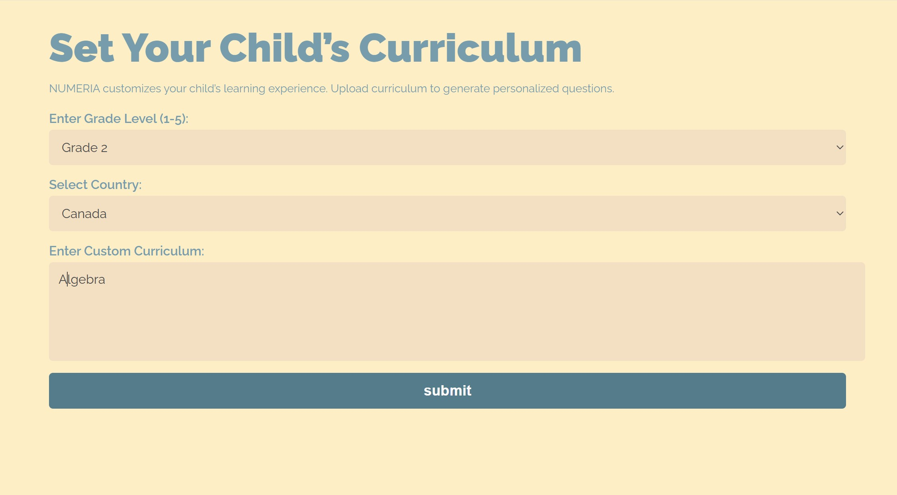

# Numeria

This project is an AI-powered math tutor that generates grade-specific math questions based on a given Grade, Country and Curriculum. It uses the **DeepSeek API** and **LangChain** to generate questions and answers dynamically.

Through Numeria, your children are getting knowledge tailored for them.
Through Numeria, there is a space for your children to learn through play.
**Through Numeria, find your treasures.**

We have 3 stages of our project:
  1) Setting up environment and make a ChatBot:
     - we have used DeepSeek API and other libraries like langchain , langchain-groq we have created a ChatBot.We are targeting
       children from grade 1 to 5 and across all countries and they can provide their curriculum and ChatBot will ask three questions.

  2) Deploy ChatBot using Cloudflare:
     - We are using Cloudflare for deployment.
       
  3) User Interface:

## 🚀 Features
- Generates math questions based on a curriculum for grades 1-5.
- Uses **DeepSeek API** for AI-generated questions.
- Allows selection of country-specific curriculums.
- Built using **Cloudflare** for an interactive UI.

## 🛠️ Tech Stack & Dependencies
To run this project, we need to install the following dependencies:

```bash
pip install langchain langchain-groq python-dotenv langchain-community streamlit
```
## 🛠️ Tech Stack & Dependencies


## 🔑 API Configuration
This project uses the **DeepSeek API**. We must set up our API key in an `.env` file.
You can get a free API key through [groq.com](url).

## ▶️ Running the Application
The application will be deployed, so make sure to click this link to play the game!
[YouTube_Link](https://www.youtube.com/watch?v=QMGu90C97QI).

[Try Live demo here](https://95f2c477.numeria.pages.dev/) 

## Practical View
 

## Scaling the project
- We are planning to connect educators aswell so they can add this game in classroom and track progress of students.
- This is a web app right now we are planning to make a mobile and desktop app.


